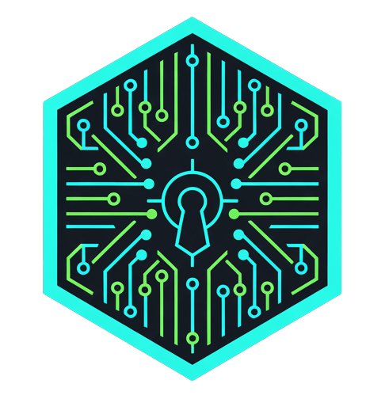

<p align="center">
  
</p>

<h1 align="center">CipherScan</h1>

<p align="center">
  <strong>⚡ The Privacy-First Zcash Blockchain Explorer</strong>
</p>

<p align="center">
  <a href="https://cipherscan.app">Mainnet</a> •
  <a href="https://testnet.cipherscan.app">Testnet</a> •
  <a href="https://cipherscan.app/docs">API Docs</a> •
  <a href="https://cipherscan.app/learn">Learn Zcash</a>
</p>

<p align="center">
  
  
  
  
</p>

---

## 📖 Table of Contents

- [About](#-about)
- [Features](#-features)
- [Live Demo](#-live-demo)
- [Quick Start](#-quick-start)
- [Tech Stack](#️-tech-stack)
- [Public Infrastructure](#-public-infrastructure)
- [API Documentation](#-api-documentation)
- [Configuration](#️-configuration)
- [Contributing](#-contributing)
- [Support the Project](#-support-the-project)
- [License](#-license)

---

## 🎯 About

CipherScan is a blockchain explorer for Zcash that makes privacy technology accessible to everyone. No jargon, no confusion — just clear, simple explanations of what's happening on-chain.

**Mission:** Make the Zcash blockchain accessible to everyone, not just developers.

---

## ✨ Features

### 🔍 Core Explorer
| Feature | Description |
|---------|-------------|
| **Search** | Find addresses, transactions, and blocks instantly |
| **Balances** | View transaction history and balances |
| **Block Explorer** | Navigate blocks with full transaction details |
| **Mempool Viewer** | Real-time pending transactions |
| **Live Updates** | WebSocket for real-time block notifications |

### 🛡️ Privacy Tools
| Feature | Description |
|---------|-------------|
| **Privacy Dashboard** | Real-time shielded adoption metrics |
| **Decrypt Memos** | Client-side Orchard memo decryption (WASM) |
| **Privacy Risks** | Round-trip transaction linkability detection |
| **100% Private** | Viewing keys never leave your browser |

### 🔗 Cross-Chain
| Feature | Description |
|---------|-------------|
| **ZEC Flows** | Real-time cross-chain swaps via NEAR Intents |
| **Inflows/Outflows** | Track ZEC moving to/from BTC, ETH, SOL + 15 chains |

### 📚 Education & UX
| Feature | Description |
|---------|-------------|
| **Learn Zcash** | Comprehensive guide to addresses, viewing keys, wallets |
| **Address Labels** | Tag addresses with custom labels (localStorage) |
| **Light/Dark Mode** | Theme toggle with system preference support |
| **Mobile Responsive** | Full mobile support |

### 🔧 Developer Tools
| Feature | Description |
|---------|-------------|
| **API Documentation** | Interactive REST API docs at `/docs` |
| **Public Infrastructure** | Free Lightwalletd gRPC + REST API |

---

## 🌐 Live Demo

| Network | URL |
|---------|-----|
| **Mainnet** | [cipherscan.app](https://cipherscan.app) |
| **Testnet** | [testnet.cipherscan.app](https://testnet.cipherscan.app) |

---

## 🚀 Quick Start

### Prerequisites

- Node.js 18+
- npm or yarn
- PostgreSQL (optional, for full indexer)

### Installation

```bash
# Clone the repository
git clone https://github.com/Kenbak/cipherscan.git
cd cipherscan

# Install dependencies
npm install

# Run development server
npm run dev

# Open http://localhost:3000
```

### Production Build

```bash
npm run build
npm start
```

---

## 🏗️ Tech Stack

| Layer | Technology |
|-------|------------|
| **Frontend** | Next.js 15, React 19, TypeScript |
| **Styling** | Tailwind CSS |
| **Database** | PostgreSQL |
| **API Server** | Express.js + WebSocket |
| **Cryptography** | Rust + WebAssembly |
| **Zcash Node** | Zebra |

---

## 🔌 Public Infrastructure

CipherScan provides **free public infrastructure** for Zcash developers:

### Mainnet

| Service | Endpoint |
|---------|----------|
| **Lightwalletd gRPC** | `lightwalletd.mainnet.cipherscan.app:443` |
| **REST API** | `https://api.mainnet.cipherscan.app/api/*` |

### Testnet

| Service | Endpoint |
|---------|----------|
| **Lightwalletd gRPC** | `lightwalletd.testnet.cipherscan.app:443` |
| **REST API** | `https://api.testnet.cipherscan.app/api/*` |

---

## 📖 API Documentation

Full interactive documentation available at [cipherscan.app/docs](https://cipherscan.app/docs)

### Quick Examples

```javascript
// Fetch block data
const block = await fetch('https://api.mainnet.cipherscan.app/api/block/2500000');
const data = await block.json();

// Fetch privacy stats
const stats = await fetch('https://api.mainnet.cipherscan.app/api/privacy-stats');
const privacy = await stats.json();
```

```python
import requests

# Fetch mempool
response = requests.get('https://api.mainnet.cipherscan.app/api/mempool')
print(f"Pending transactions: {response.json()['count']}")
```

**Rate Limit:** 100 requests/minute per IP

---

## ⚙️ Configuration

The app works out of the box with public endpoints. For custom Zcash node:

```bash
# .env.local
ZCASH_RPC_URL=http://localhost:8232
ZCASH_RPC_USER=your_username
ZCASH_RPC_PASSWORD=your_password
```

---

## 📋 Roadmap

See [GitHub Issues](https://github.com/Kenbak/cipherscan/issues) for upcoming features and improvements.

**Coming soon:** Sapling memo decryption, batch transaction scanning, CSV export.

---

## 🤝 Contributing

Contributions are welcome! Here's how you can help:

1. **Fork** the repository
2. **Create** a feature branch (`git checkout -b feature/amazing-feature`)
3. **Commit** your changes (`git commit -m 'Add amazing feature'`)
4. **Push** to the branch (`git push origin feature/amazing-feature`)
5. **Open** a Pull Request

### Development Guidelines

- Follow the existing code style
- Write meaningful commit messages
- Add tests for new features when applicable
- Update documentation as needed

---

## ☕ Support the Project

CipherScan is free, source-available, and community-driven. If you find it useful, consider supporting development:

### Zcash Donation Address (Shielded)

```
u1fh3kwyl9hq9q907rx9j8mdy2r7gz4xh0y4yt63dxykk2856gr0238vxsegemyfu8s5a77ycq72tcnzkxa75ykjtcn6wp2w9rtuu3ssdzpe2fyghl8wlk3vh6f67304xe4lrxtvywtudy5t434zc07u6mh27ekufx7ssr55l8875z7f4k76c3tk23s3jzf8rxdlkequlta8lwsv09gxm
```

> 🛡️ This is a **Unified Address** — your donation is private and encrypted.

Your support helps us:
- Keep the infrastructure running 24/7
- Add new features and improvements
- Maintain free public APIs for developers

---

## 🔐 Privacy Principles

CipherScan is built with **privacy-first** principles:

| Principle | Implementation |
|-----------|----------------|
| **No Tracking** | No Google Analytics or third-party trackers |
| **No IP Logging** | Aligned with Zcash privacy values |
| **No Cookies** | No unnecessary data collection |
| **Client-Side Decryption** | Viewing keys never leave your browser |
| **Source Available** | Verify our privacy claims yourself |

---

## 📄 License

This project is licensed under the **GNU Affero General Public License v3.0 (AGPL-3.0)** with the **Commons Clause** restriction — see the [LICENSE](LICENSE) file for details.

**What this means:**
- ✅ You can view, fork, and modify the code
- ✅ You must share your modifications under the same license
- ❌ You cannot sell this software or offer it as a paid service

---

## 🙏 Acknowledgments

- [Zcash Foundation](https://zfnd.org/) — Zebra node
- [Electric Coin Company](https://electriccoin.co/) — librustzcash
- [NEAR Protocol](https://near.org/) — Cross-chain intents
- [Zingo Labs](https://github.com/zingolabs) — zingolib inspiration

---

<p align="center">
  <strong>Built with ⚡ for the Zcash community</strong>
</p>

<p align="center">
  <a href="https://github.com/Kenbak/cipherscan">GitHub</a> •
  <a href="https://discord.gg/THspb5PM">Discord</a> •
  <a href="https://forum.zcashcommunity.com/">Forum</a>
</p>
